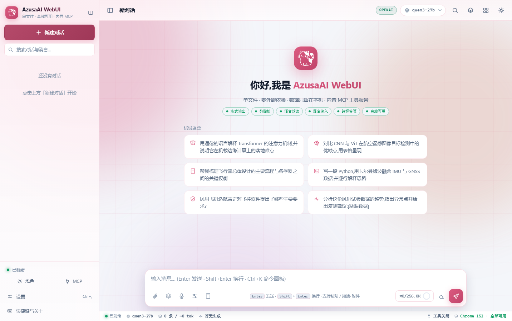
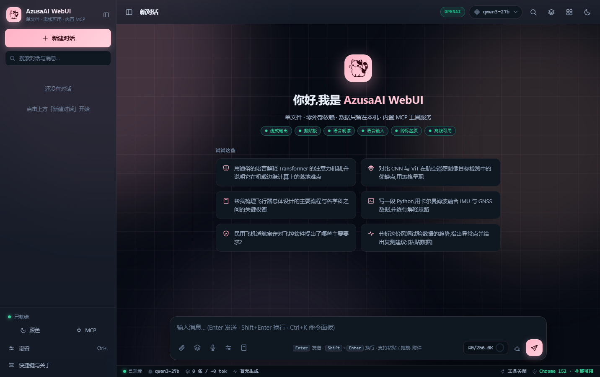
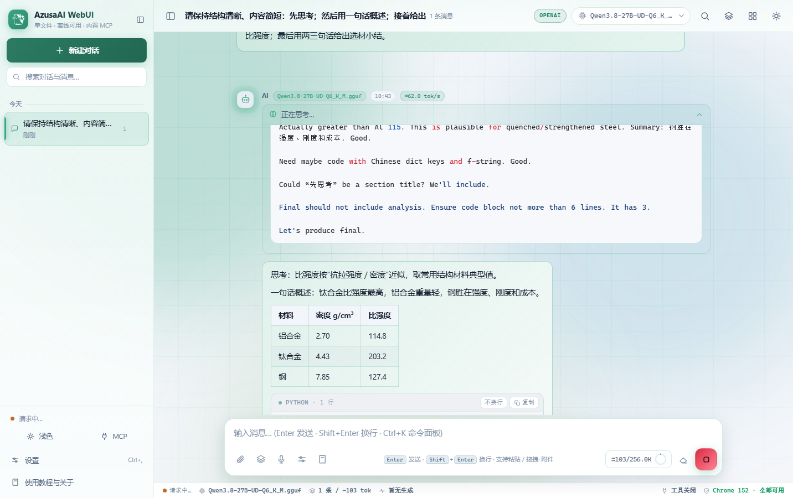
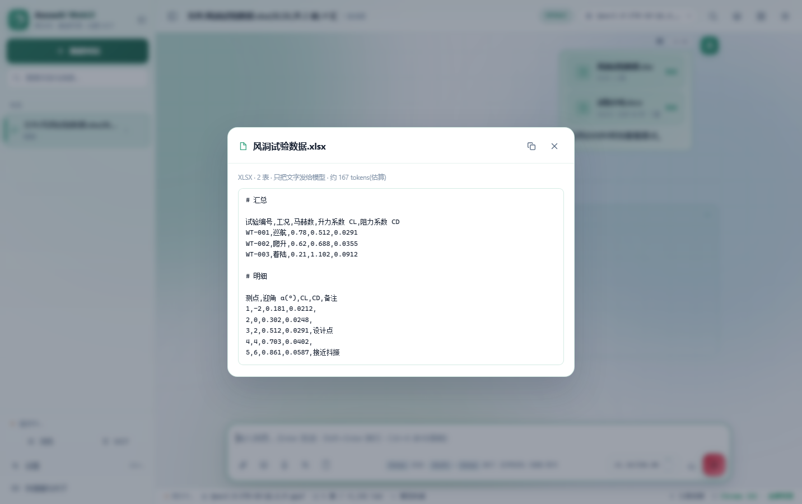
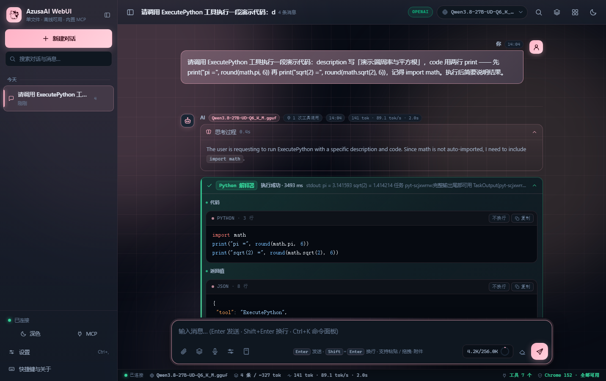
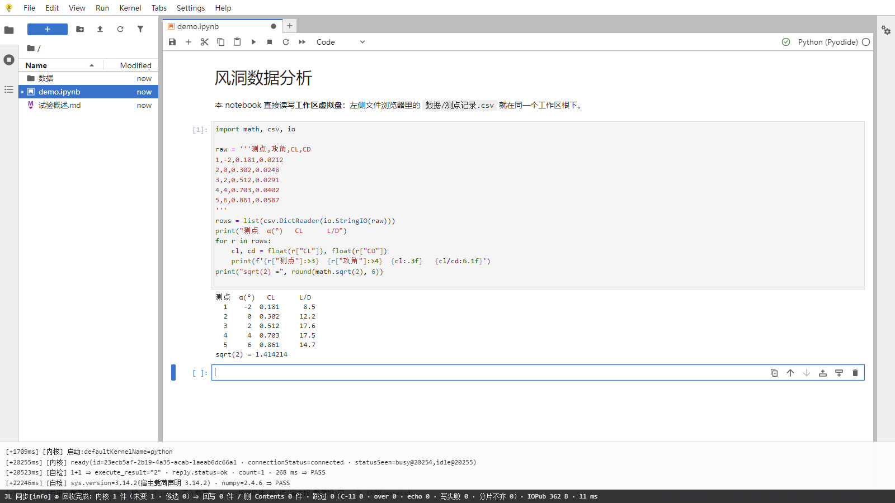
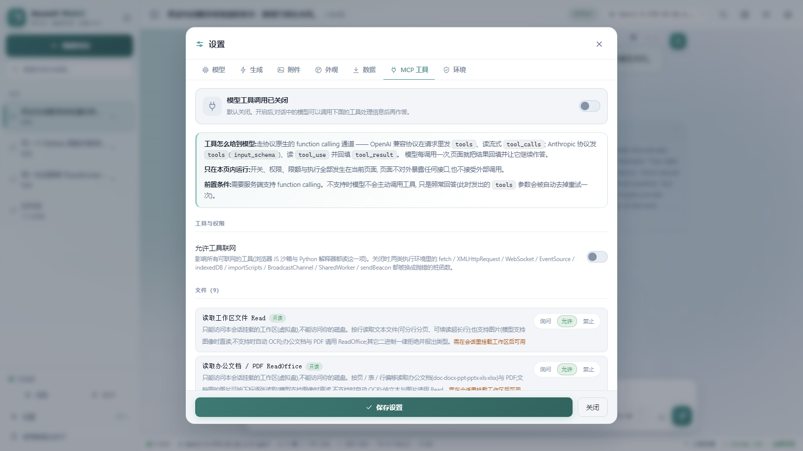
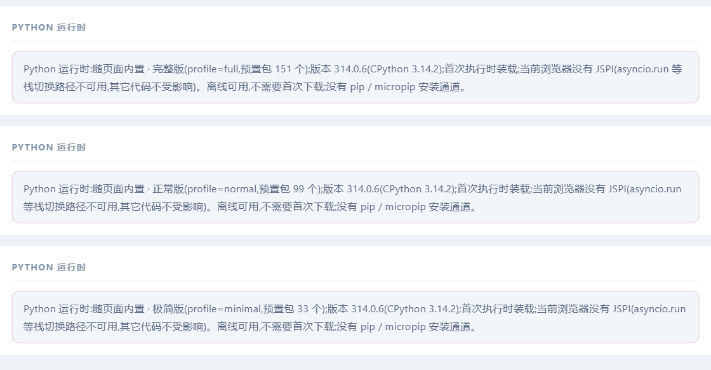
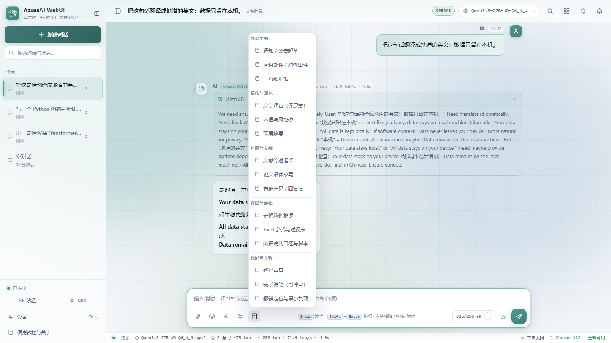

# AzusaAI WebUI

**单文件 · 离线 · 零外部请求的对话终端 —— 拷到任意目录，双击就能用。**

`v0.2.2` · `GPL-3.0` · `单文件分发` · `断网与 file:// 可用` · `数据不出本机` · `Chrome/Edge 88+` · `Firefox 85+` · `Safari 14.1+`

不需要安装、不需要联网、不需要服务器：一个 `.html` 文件，双击打开，填上自己的模型服务地址就能对话——页面上唯一会发出去的请求，就是你配置的那个地址。

<p align="center">
  
  
</p>

> 浅色 / 深色两态、12 套马卡龙主题色；图标全部内联 SVG。

## 亮点

- **一个文件就是全部**：应用、界面、内置 CPython 3.14 与本档预置包全部内联——没有安装包、没有运行环境。
- **断网可用**：脚本 / 样式 / 字体 / 图片零外链，`file://` 双击即用；OCR、办公解析、Python 执行照常。
- **数据只在你本机**：会话、附件、API Key 全在本机浏览器存储；不埋点、不上传。
- **能写文件、能跑代码**：内置沙箱 + 工作区文件工具，模型可读写文件、跑脚本、把产物下载给你。
- **还带一个 Jupyter**：工作区一键「通过 JupyterLab 打开」，notebook 跑同一份内嵌 Python，文件浏览器读写工作区。

## 快速开始

从 [Releases](../../releases) 下载三档之一 → 双击打开 → 设置 → 填 Base URL（OpenAI 兼容 `/v1/chat/completions` 或 Anthropic `/v1/messages`）→「拉取模型」→ 开始对话。

三档产物**功能与界面完全一致**，只差内置 Python 预置包数量（下表的字节数为 `v0.2.2` 三档构建实取，括号内 MB 按十进制换算：1 MB = 1,000,000 B）：

| 档位 | 预置包 | 体积 | 适合谁 |
| --- | --- | --- | --- |
| **完整版** `full` | 151 个 wheel | 228,036,289 B（228.04 MB） | `pyarrow` / `duckdb` / `pyproj` 等专业件 |
| **正常版** `normal` | 99 个 wheel | 155,987,535 B（155.99 MB） | 办公 + 科研 + 机器学习 + 绘图 |
| **极简版** `minimal` | 33 个 wheel | 74,490,600 B（74.49 MB） | `numpy` `pandas` `matplotlib` 等基础件 |

- **首次执行 Python 稍慢**：解释器懒启动，第一次把本档预置包全部装载（状态行显示 `i/N`，不计入超时），装一次常驻，空闲 10 分钟回收。
- **`file://` 与 CORS**：双击打开时 Origin 为 `null`，个别服务端会拒绝；本地起静态服务器（如 `python -m http.server`）再访问即可。

## 功能一览

### 对话与生成

| 能力 | 说明 |
| --- | --- |
| 双协议 + 流式 | OpenAI 兼容与 Anthropic 一键切换；逐字流式，读不了流时自动降级 |
| 渲染与公式 | 双方消息都渲染 Markdown（表格 / 任务列表 / 引用 / 代码围栏）+ 内嵌 KaTeX；代码块带语言与行数、块内滚动、可复制 |
| 思考过程 | 自动识别 `reasoning_content` / `thinking`，折叠块显示耗时 |
| 分支与重发 | 重新生成不删后续消息，就地分支左右切换；编辑用户消息重发自动截断其后内容 |
| 上下文 | 用量环（如 `16.4K/256.0K`）；阈值自动压缩（默认 85%）+ `Compact` 工具 + `/compact`：先生成交接总结，再彻底删除较早的消息与附件（工作区文件与后台任务不受影响，删除不可回看；压缩以工具气泡原位流式呈现，失败可见且原文保留） |
| 会话与管理 | 新建 / 重命名 / 置顶 / 副本 / 删除、按时间分组、标题与全文搜索、`Ctrl+K` 命令面板（13 条 / 5 组） |
| 多会话并发 | 一个页面内同时跑多条会话的生成：每条会话独立生成上下文，切走切回不断流；会话列表对生成中的会话显示四态徽标（生成中 / 工具执行中 / 等你操作 / 停止中）；并发上限可调（默认 3），超限的发送**不丢** —— 转入该会话的「待发送」缓冲，有空位时按排队最久自动补发 |
| 提示词模板 | 输入框上方一键插入；内置 18 条 / 6 组（办公 / 写作 / 科研 / 数据 / 代码 / 会议），含 `{{占位符}}` |

### 知识与文件

| 能力 | 说明 |
| --- | --- |
| 附件 | 纯文本 / 图片 / PDF / 办公文档；单文件 ≤ 50MB、一条消息 ≤ 10 个、单条总量默认 ≤ 100MB；二进制与危险类型拒收 |
| 图片 | 多格式重编码内联发送，超「图片最大边长」自动下采样；灯箱缩放 15%–800% |
| 附件图片策略 | **三档共用一档设置**（设置 → 附件，默认「混合」）：纯文本 = 只发抽出的文字；图片 = PDF 逐页渲染成图片（72–300 DPI）、xlsx / xls 在本机绘制表格图；混合 = 文字 + 文档里的图片一起发。模型不支持图像输入时，文档里的图片自动改走本机 OCR（只把识别文本随文字发出）；单张图片附件始终按图片发送，不受这一档影响。二进制不进本地存储 |
| 办公文档 | `doc(x)` / `ppt(x)` / `xls(x)` 六格式本机解析（pptx 带 `----- 第 N 页 -----` 标记；给模型的 xlsx / xls 默认是「地址 → 值」的 grid 视图，可要求退回 csv），并能**按地址改写**：xlsx 只动被点名的表（图表 / 批注 / 透视表等其余部件逐字节保留），xls 是值级重写（公式与样式不保留，结果里逐条写明），零网络 |
| OCR 回退 | 模型不支持视觉时走内嵌 Tesseract.js（中 / 英 / 中英），只把识别到的文字发出 |
| 语音 | 语音输入（静音 5 秒收尾）与朗读 |

**附件三档 × 格式**（设置 → 附件 →「附件图片策略」；「纯文本」档一律只发文字，没有文字层的 PDF 会自动升档）：

| 格式 | 图片档 | 混合档（默认） |
| --- | --- | --- |
| PDF | 逐页渲染成图片 | 文字 + 页图按序；不支持视觉 ⇒ 页图本机 OCR 后按序并入文字 |
| docx | 逐页渲染成页图（基于浏览器排版，分页与 Word 可能不一致） | 文字 + 文档内嵌图 |
| pptx | 本版排除 ⇒ 自动降级（有内嵌图走混合，否则只发文字，并注明原因） | 文字 + 幻灯内嵌图按幻灯段 |
| xlsx / xls | 本机绘制表格图（**仅数据网格，不含原表格式**） | 文字 + 表格内嵌图 |
| doc / ppt | 同上（无渲染器 ⇒ 降级） | 文字（解析不到图时如实注明） |
| 图片附件（png / jpg…） | 按图片发送（与档位无关；不支持视觉时本机 OCR） | 同左 |

### 代码执行、工作区与 Jupyter

| 能力 | 说明 |
| --- | --- |
| 内置 Python | CPython 3.14（pyodide 314.0.6）+ 本档预置包随页面内置，无「首次下载 / 首次安装」 |
| `ExecutePython` | 执行内联 `code` 或工作区 `script`（`args` / `stdin` / `cwd` / 超时），回传 stdout / stderr / 退出码；预置包直接 `import` |
| 任务层 | 前台 / 后台执行 + `TaskList` / `TaskOutput` / `WaitFor` / `TaskStop`（并发 2） |
| 工作区 | 每会话一块沙箱虚拟盘（IndexedDB）：模型用 9 个文件工具读写（`Read` / `ReadOffice` / `Office` 等）；右栏支持多选与右键菜单、上传 / 下载 / 整箱 ZIP |
| 交付给你 | `DownloadForUser` 把文件或整个目录（自动打包 zip）下载到本机，默认每次都要你放行 |
| 沙箱与 Jupyter | `ExecuteJavaScript` 跑在独立 Worker；右栏「通过 JupyterLab 打开」⇒ 新标签页的 JupyterLite（JupyterLab 4.6.3）以工作区为根、跑同一份内嵌 Python、文件浏览双向同步；标签页已存在时聚焦并按目标文件打开（1→1） |

### 工具（模型侧 MCP，默认关闭）

| 能力 | 说明 |
| --- | --- |
| 工具调用 | 整轮（思考 → 正文 → 调工具 → 再作答）渲染在同一气泡 |
| 内置工具 | 18 个：文件 9（`Read` / `ReadOffice` / `Office` / `DownloadForUser` 等）、执行 2、任务 4，另有 `PythonPackages` / `Compact` / `AskUser` |
| 权限与限额 | 每个工具：允许 / 询问（放行卡片）/ 禁止；超时 1–60 分钟、每轮 1–100 次、结果长度 1K–128K |
| 联网与外部 MCP | 「允许工具联网」默认关闭；可接入外部 MCP 服务器（全局默认 + 会话级覆盖）；审计日志最近 100 条（内存） |

### 外观与数据

- **外观**：12 种马卡龙配色（默认樱花粉）+ 深 / 浅 / 跟随系统 + 紧凑模式 + 动画开关；**存储**：设置存 localStorage（`chatgpt-webui-v1`），会话与附件存 IndexedDB（`chatgpt-webui-blobs`，不受 5MB 限制），启动只做「旧库搬家 + 回收无引用附件」，清理须勾选 + 确认（默认保护最近 30 个对话）。
- **备份与桌面入口**：导出会话为 Markdown / 全部为 JSON（附件内联，可完整恢复）、导入备份，多标签页设置即时同步；桌面快捷方式生成 `.url` + 6 尺寸真 `.ico`。

## 附带工具：本地反向代理（rust-proxy）

页面以 `file://` 打开时 Origin 是 `null`，有些内网模型服务会因此拒绝跨源请求。`rust-proxy/` 是一个**独立于主程序的单文件本地反向代理**：在本机应答 CORS 预检、给所有响应补上跨源头，向上游只做透明转发 —— **不改内网服务端，也不改主程序**（主程序零代码改动）。

- **两个产物**（同一份源码，只差默认上游）：**开源版** `azusa-local-proxy-win7-x64.exe`（默认上游 `http://127.0.0.1:8080`）随 Release 附件发布；**内网版** `azusa-local-proxy-win7-x64-internal.exe`（默认上游 = 构建时注入的内网地址）**本地交付**，不入库、不入 Release。两者均为 **Windows 7 SP1 及以上**与现代 Windows 通用（Rust 静态链接，无运行库与安装器要求）。
- **无配置文件**：所有参数走命令行（`--help` 有全文），设置窗「应用」只作用于本次运行；程序**不读写任何文件**（日志只在内存，可复制到剪贴板；四条豁免与细则见 [`rust-proxy/README.md`](rust-proxy/README.md)「安全与保密」），**不写注册表、不开机自启**。
- 用法四步（起代理 → Base URL 指向 `http://127.0.0.1` → 关掉「预检规避兼容模式」→ 发一条真实对话）与「CORS 分层」读法见 [`rust-proxy/README.md`](rust-proxy/README.md)。内网部署用内网版（开箱即用），或用 `--upstream http://<内网模型主机>` 显式指定；默认上游与默认监听不同址 ⇒ **不带参数可直接启动**，把上游配成与实际监听同址才会触发自环保护。
- 覆盖声明：**Win7 实机冒烟与内网真机验收尚未执行**（静态验证已绿）；用户侧验证步骤同见该 README。

## 截图

真机截图（Thorium 122 · 1600×900）。



> 生成中：思考折叠块、正文 Markdown、代码块与用量环同屏。

<p align="center">
  
  
</p>

> 左：附件卡片与 PDF 逐页预览；右：办公文档本机解析（xlsx 表数据 + 内嵌图表）。

<p align="center">
  
  
</p>

> 左：每会话一块沙箱虚拟盘（工具条含「通过 JupyterLab 打开」）；右：`ExecutePython` 卡片（代码 + stdout）。



> JupyterLite 以工作区为根，notebook 跑同一份内嵌 Python，输出与同步状态行可见。



> 设置 → MCP 工具：18 个内置工具与权限三态（默认全关），限额与调用记录同屏。

<p align="center">
  
  
</p>

> 左：三档产物的 Python 运行时状态（设置 → 环境），只差预置包数量；右：提示词模板浮窗（18 条 / 6 组）。


> 压缩：工具气泡里逐字流式的过程行与结果区摘要，丢弃条数 / 时间范围 / 释放量可在卡内核对。

## 从源码构建

**改源码请改 `src/*.part` 再重新构建**，直接改产物会被下次构建覆盖。

```bash
git lfs install && git lfs checkout              # src/pyodide.part 走 git-lfs
node scripts/make-pyodide-part.js --all          # 轻档载荷（可选）
node scripts/make-jupyterlite-part.js            # JupyterLite 载荷（可选）
node scripts/build.js --profile=all              # 三档一次拼装
node scripts/syntax.js && node scripts/lint.js   # 语法检查 / 未声明标识符检查
```

构建链只需 `node`，无 npm 依赖；各载荷由 `scripts/make-*-part.js` 从 `vendor/` 重建（幂等，取件见 [CONTRIBUTING.md](CONTRIBUTING.md)）。`src/` 是唯一源码目录（手写分段 + 内嵌库载荷）；三档产物写在仓库根、不进版本库，走 Release 附件分发。

## 数据与隐私

- **数据只在本机**：会话与附件在 IndexedDB、设置在 localStorage；附件只随对话发往你配置的模型服务。导出备份会包含 API Key（便于完整恢复），请自行保管。
- **零外部请求 + 无对外接口**：脚本 / 样式 / 字体 / 图片全部内联，断网与 `file://` 下完整可用；不暴露 `window` API、不监听 `postMessage`、没有 HTTP 端点。
- **沙箱与净化**：`ExecuteJavaScript` / `ExecutePython` 跑在独立 Worker 且默认无网络；模型侧工具默认关闭；所有渲染路径都过 DOMPurify。

## 内嵌依赖与许可

产物内嵌的第三方库：marked 12.0.2 · DOMPurify 3.1.6 · highlight.js 11.9.0 · KaTeX 0.16.11 · pdf.js 6.3.289 · Tesseract.js 7.0.0（eng + chi_sim）· pyodide 314.0.6 · mammoth / SheetJS CE / docstream / fflate · docx-preview 0.4.0 / jszip 3.10.2 / modern-screenshot 4.7.0（docx 附件的图片档渲染器）· JupyterLite 0.8.3 · jedi 0.19.2。版本、许可与出处逐条见 [THIRD_PARTY_NOTICES.md](THIRD_PARTY_NOTICES.md)。

## 兼容性与已知限制

**浏览器基线**：Chrome / Edge 88+、Firefox 85+、Safari 14.1+；低于基线时显示「浏览器版本过低」提示页。pdf.js 6 官方目标 Chrome ≥125 / Safari ≥18（**Chromium 122 实测可用**），Tesseract.js 7 需 Worker + WebAssembly；不满足时对应功能自动关闭并写明原因，其余在「环境」面板标注。

**已知限制**（多为有意取舍）：

- Jupyter 标签页依赖主页面：地址栏是 `about:blank`、刷新会白屏；重新从工作区「通过 JupyterLab 打开」即可恢复（无数据丢失，已登记为下一版修复项）。
- 中文搜索是子串匹配；长会话未做虚拟滚动；代码块显示上限 10 行；OCR 用 `tessdata_fast`，手写体与小字未实测。
- PDF 未内联 cmaps（无 ToUnicode 的老文件可能乱码）；办公解析的老格式 `doc` / `ppt` 只抽文字，图表与 EMF/WMF/TIFF 跳过；图片压缩非无损；估算出的 token 与速度带 `≈`；内嵌库只在 Chrome / Edge 上实测。

## 贡献 · 测试 · 许可

- 想改代码：从 [CONTRIBUTING.md](CONTRIBUTING.md) 开始；提交前必跑 `node scripts/build.js --profile=all && node scripts/syntax.js && node scripts/lint.js`。
- 本项目**没有常驻测试套件**：验证脚本按需现写、用完即删（模板见 CONTRIBUTING.md「验证」）。
- 文档：[CHANGELOG.md](CHANGELOG.md) · [docs/DEVELOPMENT.md](docs/DEVELOPMENT.md)（架构 / 构建链）· 内嵌库笔记见 [docs/](docs/)。
- 许可：[GNU General Public License v3.0](LICENSE)（GPL-3.0）· 版权 Copyright (C) 2026 AzusaAI WebUI。
