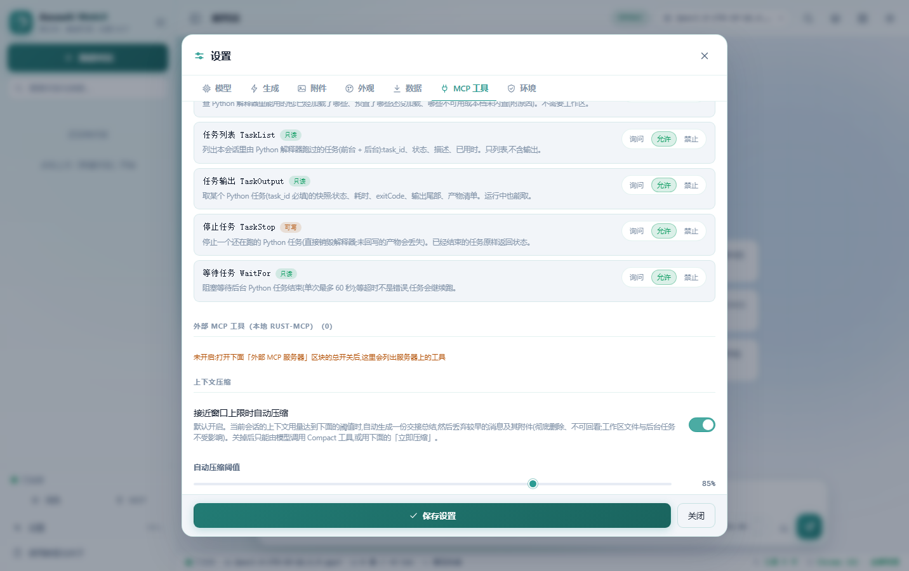
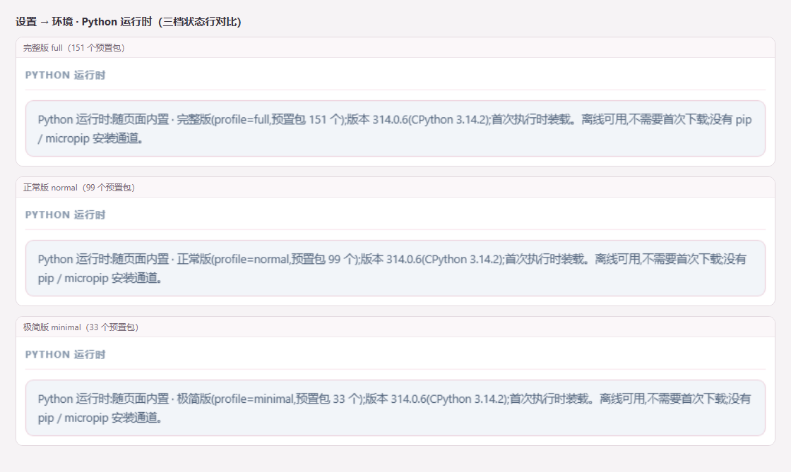

# AzusaAI WebUI

`v0.1.1` · `GPL-3.0` · `单文件` · `离线运行 · 零外部请求` · Chrome/Edge 88+ · Firefox 85+ · Safari 14.1+

**单文件 · 离线 · 零外部请求的对话终端——拷到任何地方双击就能用。** 不需要安装、不需要联网、不需要服务器；页面上唯一会发出去的请求，是你自己配置的那个模型服务地址。

- **单文件**：应用代码、界面与内置 Python 运行时全部打包在一个 HTML 里，没有安装包、没有运行环境要求。
- **离线运行**：脚本、样式、字体、图片一律内联；断网与 `file://` 双击都完整可用。
- **数据只在你本机**：会话、附件、API Key 都存在浏览器存储里；导出备份随时带走，清除浏览器数据即彻底删除。

<p align="center">
  
  
</p>

> 主界面（浅色 / 深色）：12 套马卡龙主题色、深浅两态一键切换；Logo 与全部图标是内联 SVG，不依赖字体或远程资源。

## 特性亮点

### 对话与生成

| 能力 | 说明 |
| --- | --- |
| 双协议 | OpenAI 兼容 `/v1/chat/completions` 与 Anthropic `/v1/messages`，一键切换 |
| 流式输出 | 逐字输出；浏览器不支持流式读取时自动降级为非流式 |
| Markdown | 用户与 AI 消息都渲染：表格、任务列表、引用、围栏代码；思考内容同样渲染 Markdown |
| 思考过程 | 自动识别 `reasoning_content` / Anthropic `thinking`，折叠块显示耗时，默认展开、可收起 |
| 数学公式 | 内嵌 KaTeX（20 个 woff2 字体 base64 内联）；公式先抽成占位符再回填，LaTeX 反斜杠不会被 Markdown 吃掉 |
| 代码块 | 表头显示语言与行数；超过 10 行块内滚动、可「展开全部」；复制按钮；HTML / SVG 可一键「运行」 |
| 分支 | 重新生成不删后续消息，就地新增分支，用 `‹ n/N ›` 左右切换（旧结果一直保留） |
| 编辑重发 | 编辑任意用户消息并重新生成，自动截断其后的消息 |
| 上下文用量环 | 输入区右侧实时显示 `16.4K/256.0K`；点击看本次请求构成与本对话累计明细 |
| 上下文管理 | 接近窗口上限时向模型注入用量提醒；自动压缩（阈值默认 85%，可调可关）+ `Compact` 工具 + `/compact`：先生成交接总结，再**彻底删除**较早的消息与其附件（工作区文件与后台任务不受影响，删除不可回看） |
| 上下文长度 | 模型服务未返回窗口大小时，可在生成参数浮层（「调节」）或 设置 → 生成参数 手动设置（滑块 8K–1M、步进 8K，也可直接输入 K 值）；服务端返回窗口时以服务端为准（默认 256K） |
| 斜杠命令 | 输入 `/` 开浮窗（支持模糊过滤与键盘选择）：`/compact`（可附一句摘要侧重）、`/clear`（清空本会话上下文，后台任务继续跑）、`/help`（使用教程与关于）、`/tasks`（后台任务与实时输出，可逐个或全部中止） |
| 统计口径 | token 优先取服务端 `usage`；速度取客户端实测吞吐（首字 → 最后一帧）；拿不到时才按四桶字符模型估算并加 `≈` |
| 会话管理 | 新建 / 重命名 / 置顶 / 副本 / 删除；按时间分组；标题与全文搜索；`Ctrl+F` 会话内查找、`Ctrl+K` 命令面板 |


> 同屏可见：思考折叠块、正文 Markdown、代码块与上下文用量环；状态栏的 token 与速度都来自上面那条统计口径。

### 知识与文件

| 能力 | 说明 |
| --- | --- |
| 附件 | 纯文本 / 图片 / PDF / 办公文档；单文件 ≤ 50MB、一条消息 ≤ 10 个、单条消息总量默认 ≤ 100MB（可调） |
| 类型把关 | `.exe`、压缩包等二进制明确拒绝并报出类型；宏格式提示另存为无宏；无后缀文件先读前 64KB 嗅探，确认是文本才收 |
| 图片 | PNG / JPG / GIF / WebP / BMP / AVIF / SVG / ICO / TIFF，统一重编码为 PNG / JPEG 并以 data URL 内联发送；超过「图片最大边长」（默认 4096px）自动下采样 |
| PDF | 双模式：纯文本抽取（插入页分隔）或逐页渲染成图片（72–300 DPI，默认 150）；模型不支持图像输入时，文本模式会把页内图片按页本机 OCR 后插进文本（精确取区失败自动退整页渲染）；PDF 二进制不进本地存储 |
| OCR 回退 | 模型不支持视觉时，图片自动走内嵌 Tesseract.js（中 / 英 / 中英可选），只把识别文字发给模型；PDF / 办公文档里的图片同样按文档顺序逐张识别并插进正文（单次最多 6 张、总时长 ≤60 秒，超限会写明「另有 N 图未处理」） |
| 办公文档 | `doc` `docx` `ppt` `pptx` `xls` `xlsx` 六格式本机解析：docx 抽正文 + 图片、xlsx 转 CSV、老格式仅文本；模型不支持图像输入时图片不再丢弃，改成本机 OCR 后按序接在正文之后；worker 内跑，零网络 |
| 预览与编辑 | 附件卡片点开预览弹窗（PDF 图片模式给每页缩略图）；图片灯箱支持滚轮缩放 15%–800%、拖拽平移、双击复位；消息里的附件可增删 |
| 语音 | `SpeechRecognition` 语音输入（静音 5 秒自动收尾）与语音合成朗读 |

<p align="center">
  
  
</p>

> 左：图片 / PDF / 文本统一走附件卡片，PDF 可切文字或逐页渲染；右：办公六格式本机解析（xlsx → CSV，正文与图表一次抽齐）。

### 代码执行（内置 Python 与沙箱）

| 能力 | 说明 |
| --- | --- |
| 内置 Python | 完整 CPython 3.14（pyodide 314.0.6）+ 151 个预置包 wheel，随页面内置——无「首次下载 / 首次安装」环节 |
| 三档产物 | 同一份源码，只差预置包数量：完整 151 / 正常 99 / 极简 33；单文件、离线两条约束三档相同 |
| `ExecutePython` | 模型可执行内联 `code` 或工作区 `script`（`args` / `stdin` / `cwd` / 超时），回传 stdout / stderr / 退出码；预置包**直接 `import` 即用**——本档全部预置包在首次执行前自动装载到位（无需声明任何参数） |
| 任务管理 | 前台 / 后台执行，配 `TaskList` / `TaskOutput` / `WaitFor` / `TaskStop`；并发上限 2；任务完成自动回到对话；输出过大时**保留末尾**并注明截断量 |
| 工作区 | 每个会话一块沙箱虚拟盘（IndexedDB）：模型用 6 个文件工具读写（`Read` 可直接读图片 / 办公文档 / PDF，非视觉模型自动改用本机 OCR），可上传 / 下载 / 整箱 ZIP；碰不到真实磁盘 |
| JavaScript 沙箱 | `ExecuteJavaScript` 在独立 Web Worker 运行：无 DOM、无页面数据、默认无网络，语法错误在主线程先拦下 |
| `PythonPackages` | 查询本档包的「已加载 / 已预置 / 不可用」清单，按发行名或 import 名过滤，支持 `offset` / `limit` 分页 |

<p align="center">
  
  
</p>

> 左：每个会话一个工作区（沙箱虚拟盘），模型可读写、可上传下载整箱；右：内置 Python 直接执行代码并回读结果。

### 工具（模型侧 MCP，默认关闭）

| 能力 | 说明 |
| --- | --- |
| 工具调用 | 模型在对话中调用内置 MCP 工具；整轮（思考 → 正文 → 调工具 → 再作答）渲染在同一气泡，工具卡片可展开看参数与返回值（读到的图片展开后显示缩略图，点击可放大） |
| `Read` 读什么 | 工作区里的纯文本（按行分页 / 可续读超长行）、图片、办公文档（doc·docx·ppt·pptx·xls·xlsx）与 PDF；图片与文档按模型能力处理——支持视觉就直接看图，否则自动改用本机 OCR 只回文本，对模型无感 |
| `AskUser` | 模型可在对话中提问（每题 2–4 个选项，单选 / 多选 / 「其他」自由输入）；一屏一题、可跳过或随时中止，作答以结构化结果回传模型继续执行 |
| 权限三态 | 每个工具：允许 / 询问（对话里出现待放行卡片）/ 禁止；工具自己的开关挂在对应行的权限下方 |
| 限额 | 单次执行超时 1–60 分钟（默认 10）、每轮最多 1–100 次（默认 50）、结果长度 1K–128K 字符（默认 16K） |
| 联网开关 | 面板级「允许工具联网」默认关闭；关闭时沙箱里的 `fetch` / `XMLHttpRequest` / `WebSocket` 等是抛错桩 |
| 外部 MCP | 可选连接外部 MCP 服务器：全局默认 + 会话级覆盖（跟随全局 / 本会话开 / 关），切开关不重发当前请求 |
| 审计 | 内存审计日志（工具名 / 参数摘要 / 返回值 / 耗时）保留最近 100 条，刷新即清空 |



> 工具权限三态（允许 / 询问 / 禁止）+ 限额都在此配置；默认全关，可全局或按会话放开。**用 http(s) 托管页面时，外部 MCP 服务器需把该来源加入 CORS 白名单**（`file://` 的 `null` 来源默认放行）。

### 外观与数据

| 能力 | 说明 |
| --- | --- |
| 主题 | 12 种马卡龙配色（默认樱花粉）+ 深色 / 浅色 / 跟随系统 + 紧凑模式 + 动画开关 |
| 数据存储 | localStorage 只放设置（几十 KB）；会话正文与附件在 IndexedDB（实测站点配额 ~10GB），长会话不受 5MB 限制 |
| 打开即整理 | 启动时自动把旧库搬进大仓库、回收无引用的附件记录——无损、无感，不做任何无感删除 |
| 清理空间 | 空间快满时弹窗列出占用明细，勾选 + 确认才动数据；保护范围滑块（默认保护最近 30 个对话，其数据不被清理） |
| 备份 | 导出单个会话为 Markdown、导出全部为 JSON（附件内联，可完整恢复）、导入备份 |
| 多标签页 | 多标签同步（localStorage 变更即时同步）；提示词模板库可增删 |

## 快速开始

**三步走**：把 `AzusaAI-WebUI-*.html` 拷到任意目录 → 双击打开 → 在设置里填 Base URL，点「拉取模型」选一个模型，开始对话。

三档产物功能与界面完全一致，差别只在内置 Python 包数量——按需要选一档：

| 档位 | 预置包 | 体积 | 适合谁 |
| --- | --- | --- | --- |
| **完整版** `full` | 151 个 wheel | 209 MB | 需要 `pyarrow` / `duckdb` / `pdfplumber` / `pyproj` 等专业件 |
| **正常版** `normal` | 99 个 wheel | 137 MB | 办公 + 科研 + 机器学习 + 绘图；砍掉行业垂直件与大数据管道件 |
| **极简版** `minimal` | 33 个 wheel | 55.6 MB | 只留 `numpy` `pandas` `matplotlib` 等 14 个顶层包 |



> 三档只差内置包数量（151 / 99 / 33），单文件与离线约束三档相同；实际档位显示在 设置 → 环境。

- **`file://` 与 CORS**：双击打开时页面 Origin 是 `null`，个别服务端会拒绝这类请求；在本地起任意静态服务器（如 `python -m http.server`）再访问即可正常连接。用现代浏览器打开，`file://` 下所有功能（含 OCR、办公解析、Python）同样可用。
- **首次使用提示**：内置 Python 是懒启动——第一次执行会先**装载本档全部预置包**（界面状态行与任务卡片显示进度 `i/N`），装完才跑你的代码；装载时间不计入脚本超时，装一次即常驻。解释器**空闲 10 分钟**回收（连同已装载的包一起释放，有未完成任务时保活），下次执行会自动重启并重新装载；「停止生成」会销毁解释器，下次执行重新启动属正常。
- **工具定义变化的影响**：工具 schema 属请求最前面的 `tools[]`，一旦工具集/参数变化（例如本次去掉 `ExecutePython` 的 `packages` 参数），远端服务需要为这段对话重新 prefill 一次（首字会比平时慢，历史内容不受影响）——这是协议层无法规避的，非本机故障。
- **数据只在本机**：会话、附件、API Key 全部存在浏览器存储里；清理浏览器数据即删除，请定期用「导出备份」。

## 从源码构建

产物 html 由 `src/` 下的分段源码拼装而成，**改源码请改 `src/*.part` 再重新构建**，直接改产物会被下次构建覆盖。

```bash
git lfs install && git lfs checkout      # src/pyodide.part 走 git-lfs；未拉取时构建会明确中止
node scripts/build.js                    # 默认档 → AzusaAI-WebUI-full.html
node scripts/build.js --profile=normal   # 轻档需先生成对应载荷（见 CONTRIBUTING.md）
node scripts/build.js --profile=all      # 三档一次拼装
node scripts/syntax.js && node scripts/lint.js   # 语法检查 / 未声明标识符检查
```

- 构建链只有 `node`，无 npm 依赖；轻档载荷与 `vendor/` 上游发行版不在版本库中，取件步骤见 `CONTRIBUTING.md`。
- 构建顺序、自检断言与改代码的坑见 `docs/DEVELOPMENT.md`；贡献约定与验证方法见 `CONTRIBUTING.md`。

## 项目结构

```
AzusaAI-WebUI/
├── src/                 # 唯一源码目录：手写分段 .part + 内嵌库载荷
│   ├── head.part        # 页面骨架：meta / 全部 CSS / 全部 HTML / SVG 图标精灵 / 兼容自检
│   ├── libs.part        # marked + DOMPurify + highlight.js（原样发行版）
│   ├── appA–appE.part   # 应用逻辑（同一 IIFE 的五个分段，按功能拆分；只有 appE 收尾）
│   └── *.part           # 内嵌库载荷：pdfjs / tesseract / office / pyodide*（katex 为独立文件）
├── scripts/             # 构建与工具链（纯 node，无 npm 依赖）
│   ├── build.js         # 拼装三档产物（唯一构建入口）
│   ├── make-*-part.js   # 由 vendor/ 生成各载荷 .part（幂等 + 自检）
│   └── syntax.js / lint.js / embed-fonts.js / server.js / wb.js
├── docs/                # DEVELOPMENT.md + 四份内嵌库笔记 + screenshots/
├── vendor/              # 上游发行版（不进版本库，按需取件）
├── CHANGELOG.md / CONTRIBUTING.md / LICENSE / THIRD_PARTY_NOTICES.md
└── AzusaAI-WebUI-{full,normal,minimal}.html   # 构建产物（不进版本库）
```

## 文档索引

| 文档 | 内容 |
| --- | --- |
| [CONTRIBUTING.md](CONTRIBUTING.md) | 怎么改：构建命令、代码风格、验证方法、提交与 PR |
| [CHANGELOG.md](CHANGELOG.md) | 改了啥：按版本记录的变更 |
| [docs/DEVELOPMENT.md](docs/DEVELOPMENT.md) | 架构与构建链、改代码的坑、数值口径 |
| [docs/PDFJS-NOTES.md](docs/PDFJS-NOTES.md) | pdf.js 内嵌笔记（CVE 修复、ESM→classic 改写） |
| [docs/TESS-NOTES.md](docs/TESS-NOTES.md) | Tesseract.js 内嵌笔记（blob worker、file:// 约束） |
| [docs/PYODIDE-NOTES.md](docs/PYODIDE-NOTES.md) | pyodide 载荷格式、运行时门控与实测数字 |
| [docs/OFFICE-NOTES.md](docs/OFFICE-NOTES.md) | 办公解析四库、ZIP 炸弹防线与限额表 |
| [THIRD_PARTY_NOTICES.md](THIRD_PARTY_NOTICES.md) | 内嵌第三方库的许可与出处 |

## 兼容性与已知限制

**浏览器基线**：Chrome / Edge 88+、Firefox 85+、Safari 14.1+。低于基线时启动显示「浏览器版本过低」提示页并列出缺失项，不会白屏。

| 组件 | 更高门槛 | 不满足时 |
| --- | --- | --- |
| pdf.js 6（PDF 解析 / 渲染） | 官方目标 Chrome ≥125 / Safari ≥18 | 缺少必要能力时 PDF 解析不可用，并在界面写明原因；其余功能不受影响 |
| Tesseract.js 7（OCR 回退） | 需 Worker + WebAssembly | OCR 关闭，图片退回「原图发送」 |

pdf.js 6 在缺少 `ReadableStream` 异步迭代的老内核（如 Chromium 122）上**实测可用**：内置流迭代垫片 + 手动 reader 泵，PDF 文本抽取、页图渲染与非视觉模型的图文 OCR 融合都正常。这**不等于**把 Chromium 122 升格为官方支持基线 —— Firefox / Safari / 移动端未实测，「更高门槛」一列仍是官方目标。

其余能力逐项降级：无 `ReadableStream` → 改非流式；无 `navigator.clipboard` → 退回 `execCommand`；无 `Worker` → JS 沙箱与 OCR 标记不可用并写明原因；无 `DecompressionStream` → 内联 tiny-inflate 兜底解压。所有降级项都会在状态栏与「环境」面板标注。

**已知限制**（都是有意取舍）：

- 中文搜索与查找是子串匹配，没有分词与模糊匹配；长会话（几千条消息）未做虚拟滚动。
- 代码块显示上限 10 行、工具卡片代码同样受限，看全文请点「展开全部」。
- OCR 使用 `tessdata_fast`（体积优先）；手写体 / 照片 / 小字 / 倾斜未实测。
- PDF 未内联 cmaps：依赖 Adobe CJK CMap 且无 ToUnicode 的老文件抽取可能乱码；不保证矢量精度。
- 办公解析：老格式 `doc` / `ppt` 只能抽文字；图表与 EMF/WMF/TIFF 图像跳过；无 Worker 的降级模式下限 20MB 且界面可能卡顿。
- 图片压缩非无损（有透明度转 PNG，否则 JPEG q0.9）；大图连发会吃存储配额。
- 速度与 token 是「实测优先、估算兜底」：估算值带 `≈`，短回答误差偏大。
- 内嵌库（pdf.js / Tesseract / 办公解析库）只在 Chrome / Edge 上实测，Firefox / Safari 按上面的降级路径走。

## 安全与隐私

- **数据边界**：会话与附件都存本机浏览器（IndexedDB / localStorage），不上传任何第三方；附件只随对话发往你配置的模型服务。
- **零外部请求**：脚本、样式、字体、图片全部内联，断网与 `file://` 下完整可用；页面对外只发你配置的 Base URL 请求。
- **导出须知**：导出备份会包含 API Key（便于完整恢复），请自行保管。
- **无对外接口**：页面不暴露 `window` API、不监听 `postMessage`、没有 HTTP 端点——所有开关与执行只由设置页和页面自身触发。
- **沙箱**：`ExecuteJavaScript` 与 `ExecutePython` 跑在独立 Worker，默认无网络；模型侧工具默认关闭，联网需显式打开面板开关。
- **渲染净化**：所有 Markdown / 公式 / 附件渲染路径都过 DOMPurify 或等价的转义，不直插未净化 HTML。

## 贡献 · 测试 · 许可

- 想改代码：从 [CONTRIBUTING.md](CONTRIBUTING.md) 开始（构建命令、代码风格、验证方法都在那里）。
- 本项目**没有常驻测试套件**：验证脚本按需现写、用完即删，模板见 CONTRIBUTING.md 的「验证」一节。
- 许可证：[GNU General Public License v3.0](LICENSE)（GPL-3.0）。
- 版权：Copyright (C) 2026 AzusaAI WebUI。
- 致谢：内嵌库的版本、许可与出处见 [THIRD_PARTY_NOTICES.md](THIRD_PARTY_NOTICES.md)；变更记录见 [CHANGELOG.md](CHANGELOG.md)。
